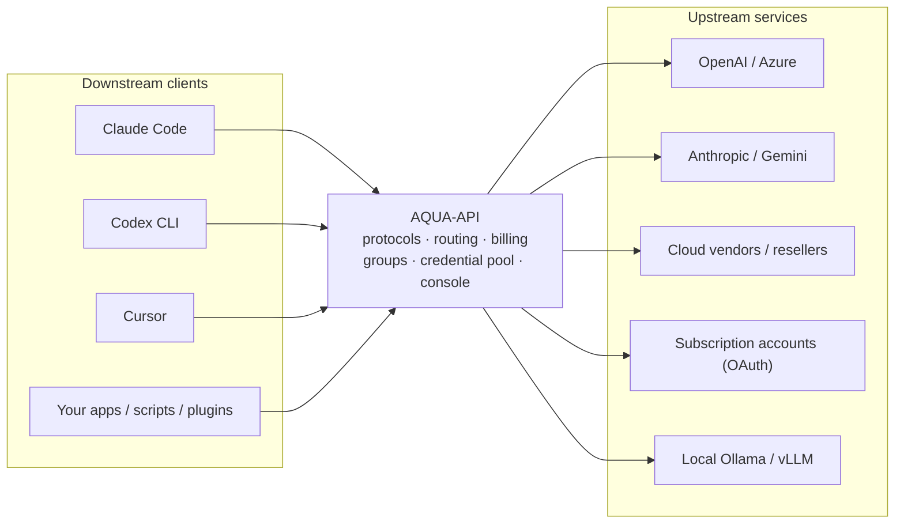

<div align="center">


# AQUA-API

**One endpoint for every AI upstream you own.**

Self-hosted LLM API Gateway · AI Usage Management

[](https://gitee.com/xiaosu4610/AQUA-API/stargazers)
[](https://gitee.com/xiaosu4610/AQUA-API/members)


[简体中文](README.md) · [English](README.en.md) · [Live demo](https://aqua.is3.cc)

</div>

---

## Official links

| Channel | Address |
| --- | --- |
| Website (live demo) | https://aqua.is3.cc |
| Primary repository (China) | https://gitee.com/xiaosu4610/AQUA-API |
| Mirror (GitHub) | https://github.com/xiaosu4610/AQUA-API (synced automatically from Gitee) |

> **This repository is the authoritative source for the official address.** If the domain changes,
> it is updated here first and only then mirrored anywhere else. Bookmarking this repository is
> therefore more reliable than bookmarking a domain.

### Beware of imposters

- This project offers and authorises **no** "top-up agent", "managed hosting" or "official shared
  account" services. The server code is fully open source under the
  [Mulan PSL v2](LICENSE) license, so anyone can self-host it —
  **being able to run it does not make a site official.**
- Only the two addresses above are official. Any other domain is unrelated to this project, even if
  the UI looks identical.
- We will never DM you asking for passwords, payment credentials or verification codes.
- By using this project you accept the [usage notice and disclaimer](DISCLAIMER.md); brand boundaries
  are defined in the [trademark statement](TRADEMARK.md).
- Before contributing, read [CONTRIBUTING.md](CONTRIBUTING.md) (Fork + Pull Request; the `main`
  branch is protected).

### Link blocked or unreachable?

Sites like this are frequently flagged by social platforms such as QQ and WeChat. If a link will
not open:

1. Try another browser, or switch networks (mobile data ↔ home broadband);
2. **Share this repository link instead of the bare domain** — code-hosting links are far less
   likely to be blocked, and anyone can confirm the current official address from the repository;
3. If you are sure it is a false positive, file an appeal through the platform's own process.

> Questions or feedback? Join the official chat group: **QQ group 1103667832**
> (entry in the top-right of the site's home page).

---

## Table of contents

- [Official links](#official-links)
- [Disclaimer](#disclaimer)
- [What is this](#what-is-this)
- [Why AQUA-API](#why-aqua-api)
- [Core features](#core-features)
- [Supported protocols and upstreams](#supported-protocols-and-upstreams)
- [Tech stack](#tech-stack)
- [Request lifecycle](#request-lifecycle)
- [Quick start](#quick-start)
- [Configuration](#configuration)
- [Client integration](#client-integration)
- [Operations guide](#operations-guide)
- [FAQ](#faq)
- [Roadmap](#roadmap)
- [Development](#development)
- [Contributing](#contributing)
- [License](#license)

---

## Disclaimer

**Read the [usage notice and disclaimer](DISCLAIMER.md) before using this project.**
It is intended for lawful technical research and internal management only; users must comply with
local laws and the terms of every upstream they connect. The author accepts no liability for losses
arising from its use.

Brand and trademark boundaries are described in the [trademark statement](TRADEMARK.md).

---

## What is this

AQUA-API is a **self-hosted LLM API gateway** and an **AI usage management system**.

Your upstreams are usually a mess of incompatible things: official OpenAI keys, Azure, Claude,
Gemini, cloud vendors, resellers, OpenAI-compatible services, subscription accounts
(Claude / Codex / Gemini), and local models on Ollama or vLLM. Your downstream is your apps:
Claude Code, Codex CLI, Cursor, your own services, scripts and plugins.

AQUA-API sits in between and turns all of it into **one endpoint, one protocol, one clear bill**.



It solves exactly three things: **unification** (one protocol, one entry), **reliability**
(automatic avoidance of failures) and **accountability** (every cent traceable).

---

## Why AQUA-API

There is no shortage of proxies. What is scarce is one you can **trust with your books**.
Every row below is a decision made after being burned by the alternative.

| Concern | The usual approach | AQUA-API |
| --- | --- | --- |
| Upstream keys | Stored in plaintext, readable in the console | AES-256-GCM encrypted at rest; the master key is env-only, so a compromised console yields no usable credentials |
| Master key | Written into the config file | The same-named config field is ignored outright; the key can never leak through the repository |
| Upstream failures | Permanently disabled after N failures, so the pool shrinks | Failure classification plus cooldown/half-open: rate limiting is temporary avoidance with automatic recovery; retired only on an explicit "credential revoked" |
| Retry policy | Retry everything, or nothing | Routed by failure type: 429 rotates the key, 5xx switches channel, 401/403 long-cooldown, content filter switches model, empty 200 downgrades — and upstream `Retry-After` is honoured |
| Rate limits and concurrency | One global threshold | Per-credential (weight, priority, per-minute limit, in-flight); groups can carry a per-minute request plan |
| Quota | Checked before and after, so concurrency overspends | Reserve → settle → refund; available = quota − used − reserved, so concurrency cannot go negative |
| Periodic budget | Only a total quota; you notice when it is spent | Token-level rolling-window budget (daily / weekly / monthly) that trips inside the window |
| Streaming billing | Reads only the first N bytes, so long answers bill 0 | Incremental SSE parsing; a `usage` frame at the very end of the stream is still captured |
| Protocols | OpenAI-compatible only | OpenAI / Anthropic / Gemini downstream, upstream adapted by channel type |
| Audience segmentation | A key is a permission; free and paid cannot be separated | Groups decide channels and prices, and a key picks its group: same upstream, separate books |
| Agent/reseller tiers | Discounts tracked by hand, books never match | Agent groups: the plaza shows "list price struck through + discounted price"; the discount *is* the group multiplier, and plaza price equals what is charged |
| Pricing flexibility | One price per model, hard to change | Prices configurable per model × group × channel; each ledger row stores a price-version snapshot, so old bills can be recomputed |
| Cost visibility | Revenue only, no idea whether you profit | True-cost reconciliation: revenue, cost and gross margin by group / channel / model; upstream cost supports per-token and per-call |
| Operations | You watch channels by hand | Channel health panel plus auto-disable by success rate; the admin console can be locked down with a CIDR allowlist |
| Compliance | One line in the terms and done | Site-wide compliance notices: terms section, model badges, first-visit acknowledgement and a top-up page note |
| Deployment | Needs a database, Redis and a compiler | Single binary plus SQLite, frontend embedded, zero CGO, no gcc required |

---

## Core features

### Gateway and forwarding

- **Three downstream protocols**: OpenAI-compatible (`/v1/chat/completions`, `/v1/models`,
  `/v1/embeddings`), Anthropic (`/v1/messages`) and Gemini (`/v1beta`) — each can take over its
  native clients directly
- **Upstream adapters**: OpenAI-compatible, Azure OpenAI (deployment + api-version), Anthropic,
  Gemini, Codex / Responses, and subscription accounts
- **Canonical intermediate form**: everything converges on the OpenAI protocol (N×1); adding an
  upstream means writing one "in", a downstream one "out"
- **Bidirectional streaming conversion**: Anthropic / Gemini SSE events ↔ OpenAI
  `chat.completion.chunk`, including tool calls
- **300-second upstream timeout** so long answers are not cut off
- **Faithful error passthrough** (RFC7807 `detail`, OpenAI `error.message`) — errors are never swallowed
- **Observable routing headers**: `X-Routed-Via`, `X-Fallback-Attempts` and `X-Upstream` make
  fallbacks transparent without packet captures

### Credential pool and scheduling

- **Five strategies**: sequential, round-robin, weighted random, least recently used and least
  in-flight (default), switchable per channel
- **Per-credential tuning**: weight, priority, per-minute limit, in-flight count, cooldown deadline
- **Failure-classified retries**:
  - `429`: rotate the key and apply a short cooldown (exponential backoff), honouring `Retry-After`
  - `5xx` / timeout: switch channel and retry
  - `401 / 403 / 402`: long cooldown, never retired hastily, so transient risk-control blocks do not
    kill good keys
  - content-filter block: switch model
  - `200` with empty content: treated as a failure and downgraded
- **Channel × model cooldown**: a failure cools down only that pair, not every model on the channel
- **Session affinity**: a session (`X-Session-Id`) pins to one credential for better cache hits, and
  drops cleanly when that credential goes unavailable
- **Channel-level circuit break**: when every credential of a channel is out of balance or quota,
  routing skips the channel proactively instead of failing after selection
- **Multiple entry modes**: single, bulk paste, merged

### Billing and accounting

- **Formula**: `quota = (prompt tokens × prompt price + completion tokens × completion price) / 1,000,000`, with per-call pricing also supported
- **Price rules**: match by model name or wildcard, attachable to groups and to specific channels
  (precedence: channel-specific price → group default price)
- **Cache price split**: cached tokens bill at a separate unit price, falling back to the input price
- **Quota safety**: reserve, settle and refund in three stages; `quota_reservations` uses a unique
  index on `request_id` as an idempotency gate; unpriced models skip reservation so free models are
  never blocked by a quota wall
- **Quota semantics**: `-1` means unlimited; the check is "remaining ≤ 0" rather than "equals 0",
  closing an overdraft hole
- **Price-version snapshot**: every request log records the price rule version it was billed
  against, so old bills can be recomputed after a price change
- **Periodic budget**: a token can be capped at "at most N quota per period" (daily, weekly or
  monthly); exceeding it inside a window trips the breaker, and the window resets lazily on expiry
  without a scheduler
- **Payment channels**: manual, Epay, Stripe, official Alipay (RSA2) and official WeChat Pay
  (APIv3 with platform certificate verification and AES-GCM)
- **Order accounting**: callback verification, idempotent crediting, late-payment recovery (a
  payment arriving after the order expired is no longer silently dropped), manual fulfilment and
  close; there is no refund endpoint, as refunds are handled privately between operator and user
- **Redeem codes**: bulk generation; redemption is a single atomic transaction, so ten concurrent
  attempts on one code yield exactly one success

### Groups, pricing and the agent system

- **Groups are first-class**: display name, billing multiplier, unlock threshold (unlocked once
  cumulative top-ups reach a bar) and a per-minute request limit
- **Admin-only groups**: wholesale and agent tiers are completely invisible to ordinary users and
  can only be assigned by an administrator
- **Agent tiers**: a user assigned to an agent group sees that tier's models and prices in the
  plaza, rendered as "list price struck through + discounted price"
- **Plaza price equals charged price**: the agent plaza price comes from the same price rules as
  billing, so there is no "looks cheap, charged at list" surprise
- **Group reference counts**: before deleting a group you are told how many channels and price rules
  it affects
- **Public quote endpoint**: `GET /api/models/quote` (no login) returns an estimate from token counts

### Operations and console

- **Model plaza**: faceted filters (group, vendor, availability) with live facet counts, search,
  sorting, card and list views, and a detail modal with pricing, effective date, a runnable cURL and
  a cost calculator
- **Channels**: CRUD, connectivity probes, credential-pool drawer (cooldown countdown, balance
  exhausted markers), one-click model list fetch from upstream, and upstream cost accounting
  (per-token and per-call)
- **Channel health panel**: success rate, cooling-down key count and remaining balance at a glance;
  unhealthy channels can be disabled automatically by success rate
- **Cost reconciliation report**: revenue, cost, gross profit and margin by group, channel and
  model, with requests lacking a recorded upstream cost flagged separately
- **Retry-ratio alerts**: per discounted group, `r = upstream calls / billed requests`, alerting when
  it crosses the break-even line for that tier
- **Tokens**: quota, expiry, model allowlist, owning group and periodic budget; plaintext is shown
  exactly once, with an audited "reveal original" recovery entry
- **Users**: registration (optional email code), email-code login and password reset, username or
  email plus password login, and time-limited trial credits with expiry reclamation
- **Referrals and check-in**: invite codes, signup and top-up reward ledger, daily check-in
- **Announcements**: banner, pinned, scheduled on and off
- **Audit log**: key admin actions are recorded and searchable
- **Content safety**: sensitive-word list with a master filter toggle (pre-filtering on generation)
- **Mail**: SMTP configurable in the console with a test send, hot-reloaded
- **Async tasks**: submit, poll and cancel; per-call billing with automatic refunds on failure
- **Also included**: users, redeem codes, orders, request logs, subscription accounts (OAuth) and
  model mappings

### Security

- Upstream keys are AES-256-GCM encrypted at rest, with the master key available only from the
  environment
- Logs never print upstream keys — not even the query string — so query-param keys cannot leak
- The admin console supports a CIDR allowlist (`AQUA_ADMIN_ALLOW_CIDRS`); anything outside is rejected
- Revealing a token's plaintext goes through a dedicated endpoint that writes an audit entry
  recording who took which token and when
- Passwords are salted and hashed; sessions use server-verified signed cookies

### Compliance notice system

- The terms of service include a section on subscription-account upstream capability
- Subscription-account models carry a "for reference" badge in the plaza
- The console shows a one-time acknowledgement dialog on first visit, stored in localStorage and
  reviewable later
- The top-up page shows a short notice before payment
- In code, subscription-account adapter files are headed with a note that they are for learning and
  reference only, and that production commercial use requires upstream authorisation

### Frontend and themes

- **Three themes**: light, dark and navy, switchable at any time and persisted locally
- **Six languages**: Simplified Chinese, English, French, Russian, Spanish and Arabic (with RTL layout)
- **Mobile**: bottom navigation, tables degrading to cards, safe-area handling and bottom-sheet modals
- **Componentised**: tables, modals, forms, charts (ECharts) and notices, consistently styled

---

## Supported protocols and upstreams

**Downstream (how apps connect to us)**: OpenAI-compatible · Anthropic · Gemini

**Upstream (how we connect out)**: **79 registered channel types** across 8 categories:

| Category | Description |
| --- | --- |
| Text LLMs | OpenAI, Azure, Anthropic, Gemini, DeepSeek, Kimi, Zhipu, Qwen, SiliconFlow, OpenRouter, Groq, Together, Mistral, xAI, Ollama, vLLM and more |
| Aggregators | Aggregating relay services |
| Subscription accounts | Claude, Codex and Gemini subscription accounts (OAuth refresh) |
| Self-hosted | Local and private deployments |
| Image | Image-generation upstreams |
| Video | Video-generation upstreams |
| Audio | Speech upstreams |
| Embedding | Embedding upstreams |

> **Straight answer**: of the 79 registered types, **37 already have a finished protocol adapter and
> authentication implementation** (`Available: true`) and are selectable. The rest are shown as
> "coming soon" and cannot be selected, so you will never configure half a channel only to find it
> cannot work. The implemented protocol and auth whitelist is pinned by
> `internal/channeltype/catalog_test.go` to prevent mislabelling.

---

## Tech stack

| Layer | Choice | Notes |
| --- | --- | --- |
| Backend | Go 1.27 + Gin v1.12 | Single binary, zero CGO (SQLite via the pure-Go `modernc.org/sqlite`) |
| Database | SQLite | Embedded and maintenance-free; migrations are per-dialect, leaving an extension seam |
| Frontend | Next.js 16.3 (static export) + React 19 + Tailwind CSS v4 + TypeScript 5 | Build output `web/dist` is embedded via `go:embed` |
| Charts | ECharts 5 | Console statistics |

<div align="center">


</div>

> The frontend uses `output: 'export'` (static). There is **no separate frontend host**: the UI and
> the API share one origin and one port, so deployment is a single binary.

---

## Request lifecycle

What a `/v1/chat/completions` call goes through inside the gateway, useful for debugging and for
extending it.

```mermaid
flowchart TD
    S["Client request"] --> P1["1. Auth and rate limiting"]
    P1 --> P1a["TokenAuth: validate token (enabled / expiry / model allowlist / owning group)"]
    P1a --> P1b["Reserve quota (step one of reserve, settle, refund)"]
    P1b --> P1c["Group RPM gate (zero cost when rpm_limit = 0)"]
    P1c --> P1d["Sensitive-word pre-filter"]

    P1d --> P2["2. Routing"]
    P2 --> P2a["Filter usable channels by group (enabled / model support / time rules)"]
    P2a --> P2b["Channel circuit check: all credentials out of balance? then skip"]
    P2b --> P2c["Pick a credential: failure cooldown + channel x model cooldown + affinity + five strategies"]

    P2c --> P3["3. Forwarding and adaptation"]
    P3 --> P3a["Inbound protocol to canonical OpenAI form to upstream adapter"]
    P3a --> P3b["Bidirectional streaming conversion (frame-level SSE)"]
    P3b --> P3c["Classified handling: 429 rotate key / 5xx switch channel / filter switch model / empty 200 downgrade"]

    P3c --> P4["4. Response and accounting"]
    P4 --> P4a["Inject observable headers (X-Routed-Via / X-Fallback-Attempts / X-Upstream)"]
    P4a --> P4b["Settle quota: refund the difference on success, full refund on failure"]
    P4b --> P4c["Write the request log (real channel / upstream model / price-version snapshot)"]
    P4c --> P4d["Update credential runtime state (last used / cooldown / failure count / balance)"]
```



---

## Quick start

### Option 1: Docker Compose (recommended)

```bash
git clone https://gitee.com/xiaosu4610/AQUA-API.git && cd AQUA-API
cp .env.example .env

docker build -t aqua-api:local .          # first build (frontend + backend + runtime image)
docker run --rm aqua-api:local -gen-key   # prints a master key; put it in .env as AQUA_APP_KEY

docker compose up -d
```

Open `http://127.0.0.1:8787`. Data lives in `./data` on the host, so moving servers is a directory copy.

### Option 2: docker run (without Compose)

```bash
docker build -t aqua-api:local .

docker run -d --name aqua-api \
  -p 8787:8787 \
  -e AQUA_APP_KEY="<your master key>" \
  -e AQUA_SERVER_LISTEN=0.0.0.0:8787 \
  -v "$PWD/data:/data" \
  --restart unless-stopped \
  aqua-api:local
```

### Option 3: Single binary (Linux / systemd)

```bash
go build -o aqua ./cmd/aqua           # pure Go, zero CGO, no gcc needed

./aqua -gen-key                        # generate the encryption master key

sudo useradd -r -s /usr/sbin/nologin aqua
sudo mkdir -p /opt/aqua /etc/aqua /var/lib/aqua
sudo cp aqua /opt/aqua/aqua && sudo chown aqua:aqua /opt/aqua/aqua

sudo cp .env /etc/aqua/aqua.env        # fill in real secrets
sudo chmod 600 /etc/aqua/aqua.env && sudo chown root:root /etc/aqua/aqua.env

sudo cp aqua-api.service /etc/systemd/system/
sudo systemctl daemon-reload && sudo systemctl enable --now aqua-api
sudo systemctl status aqua-api
```

**Upgrading**: replace `/opt/aqua/aqua` and run `sudo systemctl restart aqua-api`; migrations run
automatically on startup.

> Keep the previous binary (for example `aqua.bak-<timestamp>`). Rolling back is a copy plus a
> restart; migrations only add columns and never drop them, so they are forward-compatible.

### Option 4: From source (development)

```bash
# Frontend (optional: the bundled web/dist is a placeholder; a real UI requires a build)
cd web && npm ci && npm run build && cd ..

go build -o bin/aqua ./cmd/aqua
export AQUA_APP_KEY="<your master key>"      # Windows: $env:AQUA_APP_KEY="..."
./bin/aqua -config ./aqua.json               # without -config, defaults and env vars are used
curl http://127.0.0.1:8787/healthz
```

> **The frontend is embedded**: `go:embed` packs `web/dist` into the binary, so deployment is a
> single file. Building without the frontend build leaves a placeholder page, but the API still works.

### First run (install wizard)

Opening the site for the first time leads into the install wizard: create the super-admin account,
fill in site details, and optionally configure payment and mail. You can also sign in to the admin
panel from its own dedicated entry.

### Reverse proxy

Put Nginx or Caddy in front for HTTPS. Two things that bite people:

```nginx
location / {
    proxy_pass http://127.0.0.1:8787;
    proxy_http_version 1.1;

    # 1) Streaming must not be buffered, or the UI waits for the whole answer
    proxy_buffering off;
    proxy_cache off;

    # 2) Must exceed the gateway's upstream timeout (300s), or long answers get cut
    proxy_read_timeout 600s;
    proxy_send_timeout 600s;

    proxy_set_header Host $host;
    proxy_set_header X-Real-IP $remote_addr;
    proxy_set_header X-Forwarded-For $proxy_add_x_forwarded_for;
    proxy_set_header X-Forwarded-Proto $scheme;
}
```

> Behind Cloudflare's orange-cloud proxy, origin fetches are hard-capped at 100 seconds and return
> 524 beyond that. To use the full 300-second timeout, add a DNS-only (grey cloud) record.

---

## Configuration

Priority: **defaults < config file < environment variables**.

### Environment variables

| Variable | Required | Notes |
| --- | --- | --- |
| `AQUA_APP_KEY` | Yes | Encryption master key, env only (a same-named config field is ignored). Generate with `aqua -gen-key` |
| `AQUA_SERVER_LISTEN` | No | Defaults to `127.0.0.1:8787`; must be `0.0.0.0:8787` inside containers |
| `AQUA_SERVER_MODE` | No | `debug`, `release` or `test` |
| `AQUA_DATABASE_DRIVER` | No | Currently `sqlite` |
| `AQUA_DATABASE_DSN` | No | SQLite file path, defaults to `./data/aqua.db` (parent directory is created automatically) |
| `AQUA_RELAY_GROUP` | No | Gateway default group (where group-less tokens resolve), defaults to `default` |
| `AQUA_ADMIN_ALLOW_CIDRS` | No | Admin console allowlist, comma-separated CIDRs such as `10.0.0.0/8,1.2.3.4/32`. Empty means unrestricted |
| `AQUA_CHANNEL_AUTO_DISABLE_MIN_REQUESTS` | No | Minimum sample size for auto-disable; `0` disables auto-disable (the default) |
| `AQUA_CHANNEL_AUTO_DISABLE_SUCCESS_RATE` | No | Success-rate floor such as `0.9`; below it, and with enough samples, the channel is disabled |
| `AQUA_CHANNEL_AUTO_DISABLE_WINDOW_MINUTES` | No | Statistics window in minutes |
| `AQUA_SMTP_HOST` | No | SMTP server (email codes and notifications; also configurable in the console) |
| `AQUA_SMTP_PORT` | No | SMTP port, defaults to `465` |
| `AQUA_SMTP_USERNAME` | No | SMTP username |
| `AQUA_SMTP_PASSWORD` | No | SMTP password, env only |
| `AQUA_SMTP_FROM` | No | Sender address |
| `AQUA_SMTP_FROM_NAME` | No | Sender display name, defaults to `AQUA-API` |
| `AQUA_EPAY_KEY` | No | Epay merchant key (MD5 signature) |
| `AQUA_STRIPE_SECRET_KEY` | No | Stripe secret key |
| `AQUA_STRIPE_WEBHOOK_SECRET` | No | Stripe webhook signing secret |
| `AQUA_ALIPAY_PRIVATE_KEY` | No | Alipay application private key (RSA2; PEM or bare base64) |
| `AQUA_ALIPAY_PUBLIC_KEY` | No | Alipay public key |
| `AQUA_WECHATPAY_APIV3_KEY` | No | WeChat Pay APIv3 key (32 bytes) |
| `AQUA_WECHATPAY_PRIVATE_KEY` | No | WeChat Pay merchant private key (PEM) |
| `AQUA_WECHATPAY_PLATFORM_PUBLIC_KEY` | No | WeChat Pay platform certificate public key, used to verify callbacks |
| `AQUA_LOG_LEVEL` | No | `debug`, `info`, `warn` or `error` |
| `AQUA_LOG_FORMAT` | No | `text` or `json` |

Full sample: [`.env.example`](.env.example).

### Config file

```json
{
  "server":   { "listen": "127.0.0.1:8787", "mode": "release" },
  "database": { "driver": "sqlite", "dsn": "./data/aqua.db" },
  "log":      { "level": "info", "format": "text" }
}
```

### Two security rules

1. **Secrets never enter the database.** Payment, SMTP and the master key are env-only; only
   operational parameters (gateway URL, merchant ID, exchange rate, limits, toggles) live in the
   database and are editable in the console. Even a full database dump yields no usable credential.
2. **Back up the master key separately.** Once it changes, every stored upstream key becomes
   undecryptable and must be re-entered.

---

## Client integration

Any OpenAI-compatible client works: point the Base URL at AQUA-API and use an AQUA-API token as the key.

### curl

```bash
curl https://your-domain/v1/chat/completions \
  -H "Authorization: Bearer sk-your-token" \
  -H "Content-Type: application/json" \
  -d '{
    "model": "your-model",
    "messages": [{"role": "user", "content": "hello"}],
    "stream": true
  }'
```

### OpenAI SDK (Python)

```python
from openai import OpenAI

client = OpenAI(
    base_url="https://your-domain/v1",
    api_key="sk-your-token",
)
resp = client.chat.completions.create(
    model="your-model",
    messages=[{"role": "user", "content": "hello"}],
)
print(resp.choices[0].message.content)
```

### Claude Code / Anthropic clients

AQUA-API speaks Anthropic natively, so it can take over Claude Code traffic directly:

```bash
export ANTHROPIC_BASE_URL=https://your-domain
export ANTHROPIC_AUTH_TOKEN=sk-your-token
claude
```

### Other clients

Cursor, Codex CLI, Cherry Studio, NextChat, LobeChat and similar: choose
"OpenAI-compatible / custom OpenAI endpoint" and paste the Base URL and token.

### Estimate cost (no token needed)

```bash
curl "https://your-domain/api/models/quote?model=your-model&prompt_tokens=1000&completion_tokens=500"
```

---

## Operations guide

### How groups and channels relate

- A **channel** decides whether a request may use that upstream: which models it claims and which
  groups it belongs to;
- A **credential** (each key under a channel) decides which key is used, and can further restrict
  the groups and models it serves;
- A **token** may name its group; otherwise it falls into the gateway default group
  (`AQUA_RELAY_GROUP`).

> The most common trap: after moving channels to a new group, if you forget to update the default
> group, every group-less token immediately reports "no available channel".

### Configuring an agent tier

1. In Groups, create an agent tier (for example `agent`), set the billing multiplier to the
   wholesale discount (for example `60` for sixty percent) and enable admin-only;
2. In Prices, configure pricing for that tier, or reuse the same rules and let the multiplier
   discount them;
3. In Users, assign the reseller account's `agent_group` to that tier;
4. The agent now sees that tier in the model plaza, with "list price struck through + discounted
   price", matching what is actually charged.

### How prices are resolved

```
channel-specific price (channel_id = that channel)   <- highest priority
        | if absent, fall back to
group default price (channel_id = 0)
```

The same model and group can be priced differently per channel, for cases where different upstreams
have different costs.

### Quota and budget

- **Total quota** at both token and user level; `-1` means unlimited;
- **Periodic budget**: set "at most N per period" on a token, with daily, weekly or monthly windows;
  exceeding it returns 429 and the window resets automatically on expiry.

### Cost and margin

The console's cost reconciliation aggregates by group, channel and model:

```
gross profit = revenue (quota actually charged to users) - upstream cost (per the channel cost rules)
```

Enter upstream cost per channel either per-token or per-call. Requests with no recorded cost are
flagged separately so you remember to fill them in; otherwise that cost counts as zero and the
report looks rosier than reality.

---

## FAQ

**`/healthz` returns 503?**
The database is unreachable. Check the log for the database error; with SQLite, verify permissions
on the data directory first.

**Why can't I see upstream keys in plaintext in the console?**
By design. Keys are AES-256-GCM encrypted at rest and shown masked, so a compromised console cannot
export usable credentials. To rotate one, just overwrite it.

**After moving a channel to a new group, every token says "no available channel".**
The most common trap. The gateway has a default group (`AQUA_RELAY_GROUP`) that decides where
group-less tokens look for channels. After moving channels you must update it and restart, or
existing tokens lose their route instantly.

**Why is a free model still blocked by quota?**
Models with no matching price rule skip reservation and should not be blocked. If one is, check
whether the group has a wildcard price rule such as `*`, which makes the model "priced".

**Frequent upstream 429s or timeouts?**
429 is a credential-level failure: the gateway rotates to another key and applies a short cooldown
(exponential backoff with automatic recovery). If it happens a lot you likely have too few keys or a
low per-key limit, so add keys or lower the per-minute cap.

**A user hit a 429 because of the group's per-minute cap.**
The response carries `error.code = quota.group_rpm_exceeded` and states the group's per-minute
limit. Raise the limit or move the user to an uncapped group.

**An agent says "I see the discount but I'm charged list price".**
Normally impossible, since the agent plaza price and billing come from the same price rules. Check
two things: the agent account's `agent_group` is indeed that tier, and the agent's token was created
with that group selected (a token without the right group falls back to the default tier). If both
are correct and it still mismatches, please open an issue.

**How do I back up?**
Stop the service (or use `VACUUM INTO` for a hot copy), copy `aqua.db`, and back up `AQUA_APP_KEY`.
Without the master key the upstream keys in that backup are undecryptable bytes.

**Is MySQL or PostgreSQL supported?**
SQLite only today, which covers self-hosting and small-to-medium scale. The storage layer already
has a dialect seam (per-dialect migration directories and a driver registry with field metadata), so
adding one later does not require rewriting the business layer.

**How do I add a new upstream channel type?**
Register its metadata in `internal/channeltype/catalog.go` (default base URL, auth mode, extra
required parameters, path template and capability flags) and confirm it against the implemented
whitelist in `catalog_test.go`. If it belongs to an existing protocol family such as
OpenAI-compatible, that is all; a different protocol needs an adapter in `internal/relay/`.

**Why don't I see my upstream key in the logs?**
Also by design: logs print whether credentials were injected plus the upstream host and path, and
not even the query string, so query-param keys cannot leak.

**How do I see which channel handled a request and how many fallbacks it took?**
The response carries `X-Routed-Via`, `X-Fallback-Attempts` and `X-Upstream`; the request log also
records the real channel and upstream model name.

---

## Roadmap

- [x] Protocol conversion (OpenAI ↔ Anthropic ↔ Gemini) with bidirectional streaming and tool calls
- [x] Five credential scheduling strategies, cooldown/half-open, session affinity, in-flight counting
- [x] Reserve, settle and refund quota system; incremental streaming usage parsing
- [x] Groups and multipliers, model plaza, redeem codes, five payment channels, async tasks
- [x] Single-binary and Docker deployment with an embedded frontend
- [x] Browser install wizard and dedicated admin entry; admin audit log; announcements
- [x] Email-code login and password reset; referrals and check-in; time-limited trial credits
- [x] Failure-classified retries, channel × model cooldown, upstream `Retry-After`
- [x] Token rolling-window budgets (daily, weekly, monthly)
- [x] Per-group per-minute request plans (RPM), channel-level balance circuit break
- [x] Agent tiers with plaza discount display, public quote endpoint
- [x] True-cost reconciliation (revenue − cost − gross profit), price-version snapshots
- [x] Channel health panel and auto-disable by success rate, admin CIDR allowlist
- [x] Three themes (light, dark, navy) and site-wide compliance notices
- [ ] AWS Bedrock and Google Vertex signature authentication
- [ ] Image, video and audio upstream adapters (registered; adapters pending)
- [ ] UI for per-channel price entry (backend capability is ready)
- [ ] Subscription quota-window visualisation (auto-reset every 5h / day / week)

---

## Development

```bash
go build ./...       # build
go test ./...        # test
gofmt -w .           # format

cd web && npm ci && npm run type-check && npm run build   # frontend
```

Directory layout (this repository root is the code directory):

```
cmd/aqua/              entrypoint (wiring only)
internal/config/       config loading and validation
internal/model/        domain models and repository interfaces
internal/store/        persistence (SQL and versioned migrations, per dialect)
internal/server/       HTTP layer (routing, middleware, handlers)
internal/relay/        protocol adaptation and forwarding (routing, billing, cooldown)
internal/payment/      payment channel adapters
internal/channeltype/  channel type registry (79 types)
internal/i18n/         server-side localisation
web/                   frontend (Next.js; build output embedded into the binary)
Dockerfile             multi-stage: frontend, backend, minimal runtime
aqua-api.service       systemd unit for bare-metal deployment
```

### Mandatory conventions

1. **Small commits**: commit each independently describable step immediately, never batch
   everything into one commit. Every commit should be buildable and revertible. The full commit
   timeline is the project's provenance record; squashing is not allowed.
2. **Structured comments**: every source file starts with an Intent, Flow and Extension header
   describing what the code does, how data flows and where to extend it. Technical reasons only.
3. **Secrets never in the database, on disk or in logs**; see "Two security rules" above.
4. **Originality red line**: reading, studying and learning from any public project (including
   reference implementations) to understand features and algorithms is allowed, but verbatim copying
   of code, comments, constant tables or naming conventions is not. The test is simple: can you
   explain this implementation's design trade-offs without the reference project?

See [`AGENTS.md`](AGENTS.md) (Chinese) and [`CONTRIBUTING.md`](CONTRIBUTING.md).

---

## Contributing

- The `main` branch is protected; only maintainers push to it. External changes go through
  Fork + Pull Request.
- Create as many `feature/*` and `fix/*` branches as you like in your own fork, then open a PR to
  merge back. Merges are not squashed, preserving your commit timeline.
- Commit conventions, verification checklist and issue/PR templates are in
  [CONTRIBUTING.md](CONTRIBUTING.md).

---

## License

Source code is licensed under the [Mulan Public License, Version 2 (Mulan PSL v2)](LICENSE).

> Under its terms you may freely copy, use, modify and redistribute this software, including
> commercially, provided you retain the license text and the copyright, trademark, patent and
> disclaimer notices. No trademark rights are granted.

Companion documents:

| File | Purpose |
| --- | --- |
| [LICENSE](LICENSE) | Full license text (Mulan PSL v2) |
| [DISCLAIMER.md](DISCLAIMER.md) | Usage notice and disclaimer |
| [TRADEMARK.md](TRADEMARK.md) | Brand and trademark statement |
| [NOTICE](NOTICE) | Copyright, originality record and redistribution duties |
| [CONTRIBUTING.md](CONTRIBUTING.md) | Contribution guide (Fork + PR workflow) |
| [AGENTS.md](AGENTS.md) | Code guide (Chinese, for AI assistants and developers) |

---

<div align="center">

**If this saved you an afternoon of reconciling invoices, a star is appreciated.**

[Live demo](https://aqua.is3.cc) · [Issues](https://gitee.com/xiaosu4610/AQUA-API/issues) · [GitHub mirror](https://github.com/xiaosu4610/AQUA-API) · [简体中文](README.md)

</div>
