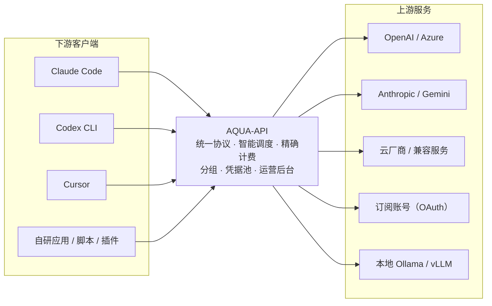
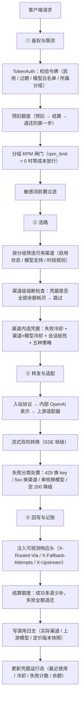

<div align="center">


# AQUA-API

**把你的所有 AI 上游，收进一个入口。**

自托管 LLM API 网关 · AI 用量管理系统

[](https://gitee.com/xiaosu4610/AQUA-API/stargazers)
[](https://gitee.com/xiaosu4610/AQUA-API/members)


[简体中文](README.md) · [English](README.en.md) · [在线演示](https://aqua.is3.cc)

</div>

---

## 官方地址

| 渠道 | 地址 |
| --- | --- |
| 官方网站（在线演示） | https://aqua.is3.cc |
| 主仓库（国内） | https://gitee.com/xiaosu4610/AQUA-API |
| 镜像仓库（海外） | https://github.com/xiaosu4610/AQUA-API（由 Gitee 自动同步） |

> **本仓库是官方地址的唯一权威来源。** 域名如有变更，会先在这里更新，再同步到其它任何地方。
> 因此，收藏本仓库比收藏一个域名更可靠。

### 防伪提醒

- 本项目**不提供、也未授权**任何「代充」「代运营」「官方合租」服务。服务端代码完全开源
  （[木兰宽松许可证 第 2 版](LICENSE)），任何人都可以自建 —— **能跑起来 ≠ 是官方**。
- 只认上表中的两个地址。其它域名即使界面一模一样，也与本项目无关。
- 官方不会私聊索要账号密码、支付口令或验证码。
- 使用本项目即视为接受[《使用者须知与免责声明》](DISCLAIMER.md)；品牌边界见[《品牌与商标声明》](TRADEMARK.md)。
- 参与开发前请先读[《贡献指南》](CONTRIBUTING.md)（Fork + PR 模式，`main` 分支受保护）。

### 链接打不开？

这类站点被社交软件（QQ／微信等）误报拦截是常见现象。遇到时：

1. 换浏览器，或切换网络（移动数据 ↔ 家庭宽带）再试；
2. **分享本仓库地址而不是裸域名** —— 代码托管平台的链接被误拦的概率低得多，
   而且对方能从仓库里自行确认最新官网地址；
3. 若确认是误拦，按平台提示提交申诉即可。

> 遇到问题欢迎加入交流群：**QQ 群 1103667832**（站点首页右上角「加入群聊」入口）。

---

## 目录

- [官方地址](#官方地址)
- [免责声明](#免责声明)
- [这是什么](#这是什么)
- [为什么选择](#为什么选择)
- [核心特性](#核心特性)
- [支持的协议与上游](#支持的协议与上游)
- [技术栈](#技术栈)
- [请求的完整生命周期](#请求的完整生命周期)
- [快速开始](#快速开始)
- [配置](#配置)
- [接入示例](#接入示例)
- [运营指南](#运营指南)
- [常见问题](#常见问题)
- [路线图](#路线图)
- [开发](#开发)
- [参与贡献](#参与贡献)
- [许可证](#许可证)

---

## 免责声明

**使用本项目前，请先阅读[《使用者须知与免责声明》](DISCLAIMER.md)。**
本项目仅供合法的技术研究与内部管理使用；使用者须遵守所在地区法律法规
及所接入上游服务的条款。作者不对使用本项目产生的任何损失承担责任。

品牌与商标的边界见[《品牌与商标声明》](TRADEMARK.md)。

---

## 这是什么

AQUA-API 是一个**自托管的 LLM API 网关**，同时是一套 **AI 用量管理系统**。

你手上的上游通常是一团互不兼容的东西：OpenAI 官方 Key、Azure、Claude、Gemini、各家云厂商、
各类 OpenAI 兼容服务、订阅来的账号（Claude / Codex / Gemini），以及本地跑的 Ollama / vLLM。
而你的下游是各种应用：Claude Code、Codex CLI、Cursor、自研 App、脚本、插件。

AQUA-API 站在中间，把这一团整理成**一个入口、一套协议、一本清楚的账**。



它解决的核心问题只有三个词：**统一**（协议与入口）、**可靠**（故障自动避让）、**可算账**（每一分钱有据可查）。

---

## 为什么选择

同类网关不少，缺的是**能安心托付账目**的那一个。下面每一条都是踩过坑之后的设计。

| 关注点 | 常见做法 | AQUA-API |
| --- | --- | --- |
| 上游密钥 | 明文存库，后台可看回明文 | AES-256-GCM 加密落库，主密钥只从环境变量注入；后台被攻破也导不出明文 |
| 加密主密钥 | 一并写进配置文件 | 配置文件中的同名字段直接被忽略，只能走环境变量，不会随仓库泄露 |
| 上游故障 | 连续失败即永久禁用，池子越用越小 | 失败分类 + 冷却半开：限流只是临时避让、到期自动恢复；仅在上游明确声明凭据吊销时才摘除 |
| 重试策略 | 一律重试，或一律不重试 | 按失败类型分流：429 冷却换 key、5xx 换渠道、401/403 长冷却、内容审核换模型、空 200 降级，并尊重上游 `Retry-After` |
| 限流与并发 | 全局一个阈值，一限全限 | 按凭据独立计（权重 / 优先级 / 每分钟上限 / 在途数）；分组可设每分钟请求套餐 |
| 额度 | 请求前后各查一次，并发下会透支 | 预扣 → 结算 → 退还，可用额度 = 额度 − 已用 − 在途，并发也扣不出负数 |
| 周期预算 | 只有总额度，花超才知道 | 令牌级滚动窗口预算（日 / 周 / 月），窗口内超限自动熔断 |
| 流式计费 | 只读响应前若干字节，长回答计 0 费 | 增量解析 SSE，`usage` 出现在流的最后一帧也能拿到 |
| 协议 | 只做 OpenAI 兼容 | 下游 OpenAI / Anthropic / Gemini 三套协议齐备，上游按渠道类型选适配器 |
| 人群区分 | 密钥即权限，无法区分免费与付费 | 分组决定可用渠道与价格，密钥可选分组：同一份上游，免费人群与付费人群各走各的账 |
| 代理拿货 | 靠人工记折扣，账目对不上 | 代理分组：广场按代理身份展示「划线原价 + 折后价」，折扣即分组倍率，广场价与实际扣费同源 |
| 定价灵活性 | 一个模型一个价，改不动 | 价格按「模型 × 分组 × 渠道」三维可配；每条账记录定价版本快照，改价后旧账仍可复算 |
| 成本可见 | 只有收入，不知道赚没赚 | 真实成本对账报表：按分组 / 渠道 / 模型聚合收入、成本与毛利，进货价按量按次都能核算 |
| 运维 | 渠道挂了靠人盯 | 渠道健康面板 + 按成功率自动停用；管理后台支持 CIDR 白名单收紧访问 |
| 合规 | 一句免责声明了事 | 协议声明章节 + 模型徽标 + 首访确认弹窗 + 充值页提示的全站合规提示体系 |
| 部署 | 要装数据库、Redis、编译环境 | 单二进制 + SQLite，前端已内嵌，零 CGO，不需要 gcc |

---

## 核心特性

### 网关与转发

- **下游三协议**：OpenAI 兼容（`/v1/chat/completions`、`/v1/models`、`/v1/embeddings`）、
  Anthropic（`/v1/messages`）、Gemini（`/v1beta`）—— 三套入站协议均可直接接管对应客户端
- **上游适配器**：OpenAI 兼容、Azure OpenAI（部署名 + api-version）、Anthropic、Gemini、
  Codex / Responses，以及各类订阅账号
- **统一中间表示**：内部全部收敛到 OpenAI 协议（N×1），新增上游只写「进」，新增下游只写「出」
- **流式双向转换**：上游 Anthropic / Gemini 的 SSE 事件 ↔ OpenAI `chat.completion.chunk`，含工具调用
- **300 秒上游超时**：大模型长回答不会被掐断
- **错误原样透传**：上游真实错误（含 RFC7807 `detail`、OpenAI `error.message`）直接回传，不吞错
- **可观测路由响应头**：`X-Routed-Via`（实际命中渠道）、`X-Fallback-Attempts`（降级尝试次数）、
  `X-Upstream`（实际上游模型名），排查问题不必抓包

### 凭据池与智能调度

- **五种策略**：顺序 / 轮询 / 加权随机 / 最久未用 / 最少在途（默认），渠道级可切换
- **凭据级参数**：权重、优先级、每分钟上限、在途数、冷却截止，后台逐把可调
- **失败分类驱动重试**：
  - `429`：换密钥并把该密钥置入短冷却（指数退避），尊重上游 `Retry-After`
  - `5xx` / 超时：换渠道重试
  - `401 / 403 / 402`：长冷却（不轻易摘除，避免瞬时风控误杀好密钥）
  - 内容审核拦截：换模型
  - `200` 但内容为空：视为失败降级
- **渠道 × 模型级冷却**：失败只冷却「该渠道 × 该模型」，不牵连同渠道其它模型
- **会话粘性**：同一会话（`X-Session-Id`）固定同一把凭据以提升上游缓存命中率，目标失效自动降级
- **渠道级熔断**：某渠道全部凭据余额 / 额度耗尽时，路由主动跳过并记日志，而不是选中后再失败
- **多种录入**：单条 / 批量粘贴 / 多合一

### 计费与账务

- **口径**：`额度 = (输入 Token × 输入价 + 输出 Token × 输出价) / 1,000,000`，另支持按次计价
- **价格规则**：按模型名或通配模式匹配，可挂到分组，也可为特定渠道配专属价
  （取价优先级：渠道专用价 → 分组默认价）
- **缓存价分离**：命中上游缓存的 token 按独立单价计费（未配置时回退输入价）
- **额度安全**：预扣 + 结算 + 退还三段式；`quota_reservations` 以 `request_id` 唯一索引做幂等闸门；
  不计费模型跳过预扣，免费模型不会被额度墙挡住
- **额度语义**：`-1` 表示不限；判定用「剩余 ≤ 0」而不是「等于 0」，堵住超额透支
- **定价版本快照**：每条调用日志记录当时的计价规则版本，改价后旧账仍可按旧价复算
- **周期预算**：令牌可设「每周期最多花 N 额度」（日 / 周 / 月），窗口内超限直接熔断，
  窗口到期惰性重置，不依赖定时任务
- **支付通道**：人工确认 / 易支付 / Stripe / 支付宝官方（RSA2）/ 微信支付官方（APIv3 + 平台证书验签 + AES-GCM）
- **订单账务**：回调验签、幂等入账、迟到支付补记（订单超时关闭后到账不再静默丢弃）、
  人工补单与关单（不提供退款入口，退款由站方与用户另行约定）
- **兑换码**：批量生成；并发兑换是单事务原子扣减，10 个并发抢同一码只会成功一次

### 分组、定价与代理体系

- **分组是一等实体**：展示名、计费倍率、解锁门槛（累计充值达标才可自选）、每分钟请求上限
- **仅后台分发的分组**：批发价 / 代理档对普通用户完全不可见，只能由管理员指派
- **代理拿货档**：被指派到代理分组的用户，在模型广场看到的是他自己那一档的模型与价格，
  并以「原价划线 + 橙色折后价」对照展示
- **广场价 = 实际扣费**：代理广场价与计费取自同一套价格规则，不存在「看着便宜、实际按原价扣」
- **分组引用统计**：删除分组前告知影响多少渠道与价格规则
- **公开定价试算**：`GET /api/models/quote`（无需登录），输入 token 数即返回预估费用

### 运营与后台

- **模型广场**：分面筛选（分组 / 厂商 / 可用状态）+ 分面计数联动 + 搜索 + 排序 +
  卡片与列表双视图 + 详情弹窗（价格表、生效时间、可直接运行的 cURL、费用试算器）
- **渠道管理**：增删改、连通性测活、密钥池抽屉（冷却倒计时、余额耗尽标记）、
  一键从上游拉取模型列表、上游进价核算（按量 / 按次）
- **渠道健康面板**：各渠道成功率、冷却中密钥数、剩余余额一屏尽览；可按成功率自动停用不健康渠道
- **财务对账报表**：按分组 / 渠道 / 模型聚合收入、成本、毛利与毛利率，未录进价的请求单独标注
- **重试率告警**：按折扣分组统计 `r = 上游调用次数 / 计费请求次数`，越过该档保本线即告警
- **令牌**：额度 / 过期 / 模型白名单 / 所属分组 / 周期预算；明文仅创建时展示一次，
  并提供受审计的「查看原文」找回入口
- **用户体系**：注册（可选邮箱验证码）、邮箱验证码登录与重置密码、用户名或邮箱 + 密码登录、
  限时试用额发放与到期回收
- **邀请与签到**：邀请码、注册与充值奖励台账、每日签到
- **站点公告**：横幅提醒 + 置顶 + 定时上下线
- **操作审计**：后台关键操作留痕可查
- **内容安全**：敏感词词表 + 过滤总开关（生成类接口前置过滤）
- **邮件通道**：SMTP 后台可视化配置 + 测试发信，支持热更新
- **异步任务**：提交、轮询、取消；按次计价；失败自动退还
- **其余后台**：用户、兑换码、订单、调用日志、订阅账号（OAuth）、模型映射

### 安全

- 上游密钥 AES-256-GCM 加密落库，主密钥只能来自环境变量
- 日志永不输出上游密钥，连 URL 查询串都不输出，避免走查询参数的密钥被打印
- 管理后台支持 CIDR 白名单（`AQUA_ADMIN_ALLOW_CIDRS`），白名单外一律拒绝
- 令牌明文取回走独立接口并写审计日志，谁在何时取了哪把可查
- 密码使用加盐哈希存储；登录会话采用服务端校验的签名 Cookie

### 合规提示体系

- 用户协议新增「订阅账号类上游能力接入声明」章节
- 订阅账号类模型在广场带「学习参考」徽标
- 门户控制台首访一次性合规确认弹窗（存 localStorage，可复查）
- 充值页在支付前给出一行提示
- 代码层：订阅账号适配层文件头注明「仅供学习参考，生产商用需取得上游授权」

### 前端与主题

- **三套主题**：浅色 / 深色 / 深蓝色，随时切换，偏好本地持久化
- **六语言**：简体中文、English、Français、Русский、Español、العربية（含 RTL 布局）
- **移动端**：底部导航、表格自动降级为卡片、安全区适配、弹窗底部弹出
- **组件化**：表格 / 弹窗 / 表单 / 图表（ECharts）/ 提示，风格统一

---

## 支持的协议与上游

**下游（应用如何连接本站）**：OpenAI 兼容 · Anthropic · Gemini

**上游（本站如何连接他人）**：目录中已登记 **79 种**渠道类型，按 8 大类组织：

| 大类 | 说明 |
| --- | --- |
| 文本大模型 | OpenAI / Azure / Anthropic / Gemini / DeepSeek / Kimi / 智谱 / 通义 / 硅基流动 / OpenRouter / Groq / Together / Mistral / xAI / Ollama / vLLM 等 |
| 聚合服务 | 各类聚合中转 |
| 订阅账号 | Claude / Codex / Gemini 等订阅账号（OAuth 刷新） |
| 自建 | 本地与私有化部署 |
| 图像 | 图像生成类上游 |
| 视频 | 视频生成类上游 |
| 音频 | 语音类上游 |
| 嵌入 | Embedding 类上游 |

> **诚实说明**：79 种类型中，**已有 37 种完成协议适配器与鉴权实现**（`Available: true`），可直接选用；
> 其余类型在后台标为「即将支持」并禁止选中，不会让你配到一半才发现调不通。
> 已实现的协议与鉴权白名单由 `internal/channeltype/catalog_test.go` 钉住，防止误标。

---

## 技术栈

| 层 | 选型 | 说明 |
| --- | --- | --- |
| 后端 | Go 1.27 + Gin v1.12 | 单二进制，零 CGO（SQLite 采用纯 Go 的 `modernc.org/sqlite`） |
| 数据库 | SQLite | 嵌入式、免运维；迁移脚本按方言分目录，已留出扩展接缝 |
| 前端 | Next.js 16.3（静态导出）+ React 19 + Tailwind CSS v4 + TypeScript 5 | 构建产物 `web/dist` 由 `go:embed` 打进二进制 |
| 图表 | ECharts 5 | 后台统计图表 |

<div align="center">


</div>

> 前端采用 `output: 'export'` 静态导出，**没有独立的前端托管**：界面与 API 同源同端口，
> 部署只需一个二进制文件。

---

## 请求的完整生命周期

一次 `/v1/chat/completions` 调用在网关内部经历的路径，便于排查问题与二次开发。



---

## 快速开始

### 方式一：Docker Compose（推荐）

```bash
git clone https://gitee.com/xiaosu4610/AQUA-API.git && cd AQUA-API
cp .env.example .env

docker build -t aqua-api:local .          # 首次构建（前端 + 后端 + 运行镜像）
docker run --rm aqua-api:local -gen-key   # 打印一个主密钥，填进 .env 的 AQUA_APP_KEY

docker compose up -d
```

浏览器打开 `http://127.0.0.1:8787`。数据落在宿主机 `./data`，迁移服务器时打包该目录即可。

### 方式二：docker run（不使用 compose）

```bash
docker build -t aqua-api:local .

docker run -d --name aqua-api \
  -p 8787:8787 \
  -e AQUA_APP_KEY="<你的主密钥>" \
  -e AQUA_SERVER_LISTEN=0.0.0.0:8787 \
  -v "$PWD/data:/data" \
  --restart unless-stopped \
  aqua-api:local
```

### 方式三：单二进制（Linux 服务器 / systemd）

```bash
go build -o aqua ./cmd/aqua           # 纯 Go，零 CGO，不需要 gcc

./aqua -gen-key                        # 生成加密主密钥（只生成，不落盘）

sudo useradd -r -s /usr/sbin/nologin aqua
sudo mkdir -p /opt/aqua /etc/aqua /var/lib/aqua
sudo cp aqua /opt/aqua/aqua && sudo chown aqua:aqua /opt/aqua/aqua

sudo cp .env /etc/aqua/aqua.env        # 填入真实密钥
sudo chmod 600 /etc/aqua/aqua.env && sudo chown root:root /etc/aqua/aqua.env

sudo cp aqua-api.service /etc/systemd/system/
sudo systemctl daemon-reload && sudo systemctl enable --now aqua-api
sudo systemctl status aqua-api
```

**升级**：替换 `/opt/aqua/aqua` 后 `sudo systemctl restart aqua-api`，数据库迁移在启动时自动执行。

> 建议保留上一版二进制（如 `aqua.bak-<时间戳>`）。回滚只需 `cp` 回旧文件再重启；
> 数据库迁移只增列、不删列，向前兼容。

### 方式四：源码直接运行（开发）

```bash
# 前端（可选：仓库中的 web/dist 为占位，正式界面需构建后才会内嵌）
cd web && npm ci && npm run build && cd ..

go build -o bin/aqua ./cmd/aqua
export AQUA_APP_KEY="<你的主密钥>"      # Windows: $env:AQUA_APP_KEY="..."
./bin/aqua -config ./aqua.json          # 不加 -config 则使用默认值与环境变量
curl http://127.0.0.1:8787/healthz
```

> **前端是内嵌的**：`go:embed` 会把 `web/dist` 打进二进制，所以部署只需要一个文件。
> 直接 `go build` 而不构建前端时，界面会是占位页，但 API 完全可用。

### 首次使用（安装向导）

首次打开站点会进入安装向导：创建超级管理员账号 → 填写站点信息 →（可选）配置支付与邮件通道。
也可以从后台独立入口登录管理面板。

### 反向代理

对外提供服务时建议前置 Nginx 或 Caddy 并启用 HTTPS。两个容易踩的点：

```nginx
location / {
    proxy_pass http://127.0.0.1:8787;
    proxy_http_version 1.1;

    # 1) 流式响应必须关闭缓冲，否则前端要等整段生成完才逐字显示
    proxy_buffering off;
    proxy_cache off;

    # 2) 超时必须大于网关的上游超时（默认 300 秒），否则长回答会被反代先掐断
    proxy_read_timeout 600s;
    proxy_send_timeout 600s;

    proxy_set_header Host $host;
    proxy_set_header X-Real-IP $remote_addr;
    proxy_set_header X-Forwarded-For $proxy_add_x_forwarded_for;
    proxy_set_header X-Forwarded-Proto $scheme;
}
```

> 若域名挂在 Cloudflare 橙云代理后面，注意 CF 回源有 100 秒硬上限，超过会返回 524。
> 想完整吃到 300 秒超时，请增加一条灰云（DNS only）记录直连源站。

---

## 配置

优先级：**默认值 < 配置文件 < 环境变量**。

### 环境变量

| 变量 | 必填 | 说明 |
| --- | --- | --- |
| `AQUA_APP_KEY` | 是 | 加密主密钥，只能走环境变量（配置文件里的同名字段会被忽略）。用 `aqua -gen-key` 生成 |
| `AQUA_SERVER_LISTEN` | 否 | 监听地址，默认 `127.0.0.1:8787`；容器内须为 `0.0.0.0:8787` |
| `AQUA_SERVER_MODE` | 否 | `debug` / `release` / `test` |
| `AQUA_DATABASE_DRIVER` | 否 | 目前为 `sqlite` |
| `AQUA_DATABASE_DSN` | 否 | SQLite 文件路径，默认 `./data/aqua.db`（父目录自动创建） |
| `AQUA_RELAY_GROUP` | 否 | 网关默认分组（不带分组的令牌走哪个分组），默认 `default` |
| `AQUA_ADMIN_ALLOW_CIDRS` | 否 | 管理后台访问白名单，逗号分隔的 CIDR（如 `10.0.0.0/8,1.2.3.4/32`）。留空表示不限制 |
| `AQUA_CHANNEL_AUTO_DISABLE_MIN_REQUESTS` | 否 | 渠道自动停用的最小样本数，`0` 表示关闭自动停用（默认关闭） |
| `AQUA_CHANNEL_AUTO_DISABLE_SUCCESS_RATE` | 否 | 成功率下限（如 `0.9`），低于它且样本足够时停用该渠道 |
| `AQUA_CHANNEL_AUTO_DISABLE_WINDOW_MINUTES` | 否 | 统计窗口（分钟） |
| `AQUA_SMTP_HOST` | 否 | SMTP 服务器地址（邮件验证码与通知，也可在后台配置） |
| `AQUA_SMTP_PORT` | 否 | SMTP 端口，默认 `465` |
| `AQUA_SMTP_USERNAME` | 否 | SMTP 用户名 |
| `AQUA_SMTP_PASSWORD` | 否 | SMTP 密码，只能走环境变量 |
| `AQUA_SMTP_FROM` | 否 | 发件人地址 |
| `AQUA_SMTP_FROM_NAME` | 否 | 发件人显示名，默认 `AQUA-API` |
| `AQUA_EPAY_KEY` | 否 | 易支付商户密钥（MD5 签名） |
| `AQUA_STRIPE_SECRET_KEY` | 否 | Stripe Secret Key |
| `AQUA_STRIPE_WEBHOOK_SECRET` | 否 | Stripe Webhook 签名密钥 |
| `AQUA_ALIPAY_PRIVATE_KEY` | 否 | 支付宝应用私钥（RSA2，支持 PEM 与裸 base64） |
| `AQUA_ALIPAY_PUBLIC_KEY` | 否 | 支付宝公钥 |
| `AQUA_WECHATPAY_APIV3_KEY` | 否 | 微信支付 APIv3 密钥（32 字节） |
| `AQUA_WECHATPAY_PRIVATE_KEY` | 否 | 微信支付商户私钥（PEM） |
| `AQUA_WECHATPAY_PLATFORM_PUBLIC_KEY` | 否 | 微信支付平台证书公钥，用于校验回调签名 |
| `AQUA_LOG_LEVEL` | 否 | `debug` / `info` / `warn` / `error` |
| `AQUA_LOG_FORMAT` | 否 | `text` / `json` |

完整样例见 [`.env.example`](.env.example)。

### 配置文件

```json
{
  "server":   { "listen": "127.0.0.1:8787", "mode": "release" },
  "database": { "driver": "sqlite", "dsn": "./data/aqua.db" },
  "log":      { "level": "info", "format": "text" }
}
```

### 两条安全铁律

1. **密钥类配置一律不入库**。支付、SMTP 与加密主密钥只能从环境变量注入；只有运营参数
   （网关地址、商户号、汇率、限额、开关）进数据库、后台可改。即使数据库被完整拖走，
   也拿不到任何一把能直接用的凭据。
2. **主密钥务必单独备份**。它一旦变更，库里所有上游密钥就再也解不开，只能重新录入。

---

## 接入示例

任何 OpenAI 兼容客户端，把 Base URL 指过来、Key 换成 AQUA-API 的令牌即可。

### curl

```bash
curl https://你的域名/v1/chat/completions \
  -H "Authorization: Bearer sk-你的令牌" \
  -H "Content-Type: application/json" \
  -d '{
    "model": "你的模型名",
    "messages": [{"role": "user", "content": "你好"}],
    "stream": true
  }'
```

### OpenAI SDK（Python）

```python
from openai import OpenAI

client = OpenAI(
    base_url="https://你的域名/v1",
    api_key="sk-你的令牌",
)
resp = client.chat.completions.create(
    model="你的模型名",
    messages=[{"role": "user", "content": "你好"}],
)
print(resp.choices[0].message.content)
```

### Claude Code / Anthropic 客户端

AQUA-API 原生支持 Anthropic 协议，可直接接管 Claude Code 的流量：

```bash
export ANTHROPIC_BASE_URL=https://你的域名
export ANTHROPIC_AUTH_TOKEN=sk-你的令牌
claude
```

### 其他客户端

Cursor、Codex CLI、Cherry Studio、NextChat、LobeChat、沉浸式翻译等，选择
「OpenAI 兼容 / 自定义 OpenAI 接口」，填入上面的 Base URL 与令牌即可。

### 试算费用（无需令牌）

```bash
curl "https://你的域名/api/models/quote?model=你的模型名&prompt_tokens=1000&completion_tokens=500"
```

---

## 运营指南

### 分组与渠道的关系

- **渠道**决定「这个请求能不能走这条上游」：它声称支持哪些模型、属于哪些分组；
- **凭据**（渠道下的每把 key）决定「走这条上游时用哪把」，还可进一步限定它服务哪些分组与模型；
- **令牌**可指定所属分组；不指定则落入网关默认分组（`AQUA_RELAY_GROUP`）。

> 最常见的坑：把渠道移到新分组后，若忘了同步默认分组，所有「不带分组的令牌」会立刻报
> 「无可用渠道」。

### 代理拿货档怎么配

1. 在后台「分组」里新建一个代理档（如 `agent`），把计费倍率设为拿货折扣（如 `60` 表示六折），
   并打开「仅后台分发」；
2. 在「价格」里为该代理档配置价目，也可复用同一套规则靠倍率打折；
3. 在「用户」里把代理商账号的 `agent_group` 指派为该档；
4. 代理登录后，模型广场会自动切换为他的那一档，展示「原价划线 + 折后价」，且与实际扣费同源。

### 价格如何取值

```
渠道专用价（channel_id = 该渠道）   ← 最高优先级
        ↓ 没有则回退
分组默认价（channel_id = 0）
```

同一模型、同一分组可为不同渠道配不同价，用于「不同渠道成本不同，售价也应不同」的场景。

### 额度与预算

- **总额度**：令牌与用户两级，`-1` 表示不限；
- **周期预算**：在令牌上设「每周期最多花 N 元」，周期可选日 / 周 / 月；窗口内超限返回 429，
  窗口到期自动重置。

### 成本与毛利

后台「财务对账」按分组 / 渠道 / 模型聚合：

```
毛利 = 售价收入（用户实扣额度） − 上游成本（按渠道进价规则核算）
```

上游进价在「渠道成本」里按量或按次录入。没录进价的请求会在报表里单独标注，
提醒你补录，否则那部分成本会被按 0 计，报表会偏乐观。

---

## 常见问题

**`/healthz` 返回 503 怎么办？**
数据库不可用时就会 503。查看日志中的数据库错误；SQLite 场景优先检查数据目录权限。

**为什么后台看不到渠道密钥明文？**
这是刻意设计。密钥以 AES-256-GCM 密文落库，界面只显示掩码，后台被攻破也导不出可用凭据。
需要更换时直接覆盖写入新密钥即可。

**把渠道换到新分组后，所有令牌都报「无可用渠道」？**
这是最容易踩的坑。网关有一个默认分组（`AQUA_RELAY_GROUP`），决定「不带分组的令牌」去哪找渠道。
渠道迁到新分组后，必须同步修改这个默认分组并重启，否则老令牌会立刻失联。

**免费模型为什么还是被额度挡住？**
未命中任何价格规则的模型会跳过预扣，正常不应被挡。若被挡，检查分组下是否配了通配价格规则
（例如 `*`），那会让模型变成「有价」，从而走额度判定。

**上游返回 429 或超时频繁？**
429 属于凭据级失败：会换密钥重试并把该密钥置入短冷却（指数退避，到期自动恢复）。
若频发，通常是密钥太少或上游限速低，去渠道里加密钥或调低单密钥的每分钟上限。

**分组设了每分钟上限，用户被 429 了怎么办？**
返回体中的 `error.code` 是 `quota.group_rpm_exceeded`，提示该分组的每分钟上限。
把上限调大，或把用户移到不限速的分组即可。

**代理说「看到折扣价但扣的是原价」？**
正常情况下不会：代理广场价与计费取自同一套价格规则。请确认两点：
一是代理账号的 `agent_group` 确实指派为该代理档；二是该代理创建令牌时选择的分组是这个代理档
（令牌没选对分组就会走默认档）。两者都正确仍不一致，请提 Issue。

**数据怎么备份？**
SQLite 场景下：停服务（或用 `VACUUM INTO` 热备）→ 拷贝 `aqua.db` → 同时备份 `AQUA_APP_KEY`。
少了主密钥，备份里的上游密钥就是一堆无法解密的字节。

**支持 MySQL 或 PostgreSQL 吗？**
当前默认且仅支持 SQLite，已能覆盖自托管与中小规模场景。存储层已经留出方言接缝
（迁移目录按方言分目录、驱动注册表带字段元数据），后续接入不需要重写业务层。

**怎么新增一个上游渠道类型？**
在 `internal/channeltype/catalog.go` 登记类型元数据（默认地址、鉴权方式、额外必填参数、
请求路径模板、能力位），并确认它落在 `catalog_test.go` 的已实现白名单内。
若属于已有协议族（如 OpenAI 兼容），登记完即可用；协议不同则需在 `internal/relay/` 增加适配器。

**为什么日志里看不到我配置的上游密钥？**
同样是刻意设计：日志只输出「是否已注入凭据」与上游主机和路径，连 URL 的查询串都不输出，
防止走查询参数的密钥被打印出来。

**怎么知道某次请求走了哪个渠道、降级了几次？**
响应头里有 `X-Routed-Via`、`X-Fallback-Attempts`、`X-Upstream`；调用日志里也记录了实际渠道与上游模型名。

---

## 路线图

- [x] 协议互转（OpenAI ↔ Anthropic ↔ Gemini），流式双向转换含工具调用
- [x] 凭据池五种调度策略、冷却半开、会话粘性、在途计数
- [x] 预扣 / 结算 / 退还的额度体系；流式用量增量解析
- [x] 分组与倍率、模型广场、兑换码、五种支付通道、异步任务
- [x] 单二进制 + Docker 部署，前端内嵌
- [x] 浏览器安装向导 + 超管独立入口；管理操作审计、站点公告
- [x] 邮箱验证码登录与重置密码；邀请返利与签到；限时试用额
- [x] 失败分类驱动重试、渠道 × 模型冷却、尊重上游 `Retry-After`
- [x] 令牌滚动窗口预算（日 / 周 / 月）
- [x] 分组每分钟请求套餐（RPM）、渠道级余额熔断跳过
- [x] 代理拿货档与广场折后价对照、公开定价试算接口
- [x] 真实成本对账报表（收入 − 成本 − 毛利）、定价版本快照
- [x] 渠道健康面板与按成功率自动停用、管理面 CIDR 白名单
- [x] 三套主题（浅色 / 深色 / 深蓝）、全站合规提示体系
- [ ] AWS Bedrock 与 Google Vertex 签名鉴权
- [ ] 图像 / 视频 / 音频类上游适配器（目录已登记，适配器待实现）
- [ ] 渠道专属价的录入界面（后端能力已就绪）
- [ ] 订阅账号配额窗口可视化（按 5 小时 / 日 / 周自动恢复）

---

## 开发

```bash
go build ./...       # 编译
go test ./...        # 测试
gofmt -w .           # 格式化

cd web && npm ci && npm run type-check && npm run build   # 前端
```

目录结构（本仓库根目录即代码目录）：

```
cmd/aqua/              程序入口（仅装配，不含业务逻辑）
internal/config/       配置加载与校验
internal/model/        领域模型与仓储接口（不含 SQL）
internal/store/        持久化实现（SQL + 版本化迁移，按方言分目录）
internal/server/       HTTP 层（路由 / 中间件 / 处理器）
internal/relay/        协议适配与转发（核心域：选路 / 计费 / 冷却）
internal/payment/      支付通道适配
internal/channeltype/  上下游类型注册表（79 种）
internal/i18n/         服务端多语言文案
web/                   前端（Next.js，构建产物内嵌进二进制）
Dockerfile             多阶段构建：前端 → 后端 → 极简运行镜像
aqua-api.service       systemd 单元（裸机部署）
```

### 工程约定（强制）

1. **小步提交**：每个可独立描述的小步骤完成后立刻提交，禁止攒到最后一次性提交；
   每次提交都应可编译、可回滚。完整提交时间线是项目创作过程的证据链，禁止 squash。
2. **注释为结构化文档**：每个源文件头部写清「意图 / 流转 / 扩展」三段，
   描述代码做什么、数据怎么流转、往哪儿扩展；只写技术原因，不写个人感想。
3. **密钥不入库、不落盘、不进日志**，详见上文「两条安全铁律」。
4. **原创性红线**：允许阅读、研究与学习任何公开项目（含参考实现）以理解功能与算法思想；
   但禁止逐字复制粘贴其代码、注释、常量表与命名风格。判据很简单：
   能否脱离参考项目，独立解释这套实现的设计取舍。

详见 [`AGENTS.md`](AGENTS.md) 与 [`CONTRIBUTING.md`](CONTRIBUTING.md)。

---

## 参与贡献

- `main` 分支受保护，仅维护者可推送；外部贡献一律走 Fork + Pull Request。
- 在你的 fork 上可开任意数量的 `feature/*`、`fix/*` 分支自由开发，
  想合入主仓库时发 PR，经审查后合并（不 squash，保留提交时间线）。
- 提交规范、验证清单与 Issue / PR 模板见 [CONTRIBUTING.md](CONTRIBUTING.md)。

---

## 许可证

源代码采用[木兰宽松许可证，第 2 版（Mulan PSL v2）](LICENSE)。

> 在遵守该许可证的前提下，你可以自由复制、使用、修改与分发本软件，包括商业用途；
> 重新分发时须附带 LICENSE 副本，并保留版权、商标、专利及免责声明。该许可证不授予任何商标权利。

配套文件：

| 文件 | 作用 |
| --- | --- |
| [LICENSE](LICENSE) | 开源协议全文（木兰宽松许可证 第 2 版） |
| [DISCLAIMER.md](DISCLAIMER.md) | 使用者须知与免责声明 |
| [TRADEMARK.md](TRADEMARK.md) | 品牌与商标声明 |
| [NOTICE](NOTICE) | 版权声明、原创性时间锚点与分发义务 |
| [CONTRIBUTING.md](CONTRIBUTING.md) | 贡献指南（Fork + PR 协作模式） |
| [AGENTS.md](AGENTS.md) | 代码导读（面向 AI 助手与开发者） |

---

<div align="center">

**如果这个项目帮你省下了对账的时间，欢迎点个 Star ⭐**

[在线演示](https://aqua.is3.cc) · [提交 Issue](https://gitee.com/xiaosu4610/AQUA-API/issues) · [GitHub 镜像](https://github.com/xiaosu4610/AQUA-API) · [English](README.en.md)

</div>
